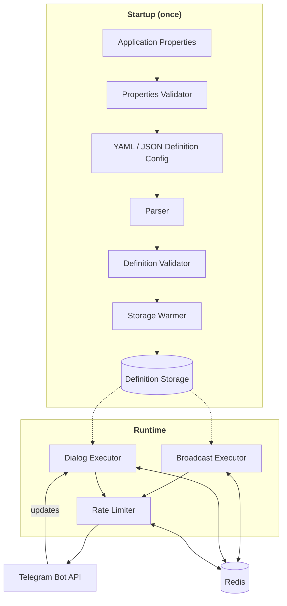

# Telegram InfoBot Engine

[](https://github.com/devexhale/telegram-infobot-engine/actions/workflows/ci.yml)
[](LICENSE)
[](https://openjdk.org/projects/jdk/21/)
[](https://spring.io/projects/spring-boot)

**Build information-driven Telegram bots by describing dialogs in YAML/JSON — no boilerplate code required.**

## 📖 About

Building an informational Telegram bot usually means writing custom code for every menu, button, and transition.
**Telegram InfoBot Engine** removes that step entirely: the whole conversation — messages, media, and navigation between
them — is described as a set of connected nodes in a single YAML or JSON file. Connect the Spring Boot starter, fill in
the required and optional properties, define your dialog nodes, and the bot is ready to deploy — **no code required**.

Work that would normally take weeks of custom development can be done in a few hours, since all the effort goes into
designing the conversation flow itself, not implementing it.

The engine is built for **long-polling, button-driven bots** — users navigate the conversation exclusively through
buttons, moving from one dialog node to the next.

### Typical use cases include:

- FAQ bots for products and services
- News and article delivery bots
- Blog companion bots
- Quest / quiz bots
- Sales bots linking to external products and services
- Referral bots

## ✨ Key Features

- 📝 **Config-Driven, Not Code-Driven** — Create and change dialog flows and content by editing YAML/JSON — no Java code
  changes required.
- 🧭 **Dialog Navigation** — Multi-step conversations driven entirely by inline and reply keyboards. User state is
  persisted in Redis, and the engine automatically routes between dialog nodes based on button presses.
- 📱 **Multi-Content Messages** — Combine text, photos, videos, audio, and documents within a single dialog node, in any
  quantity and any order — each content type is handled by a dedicated content handler, and items are delivered in
  exactly the order they're defined.
- 🧹 **Automatic Chat Cleanup** — Previous messages are automatically removed as users move between nodes, and any
  irrelevant input the user sends — text, files, or other messages — is cleaned up as well, keeping the chat interactive
  and free of clutter.
- 🚦 **Distributed Rate Limiting** — Global and per-chat limits backed by Redis and Bucket4j, pre-configured with
  sensible defaults so you don't have to worry about your bot getting blocked or banned by Telegram — while still
  allowing every limit to be manually fine-tuned to your needs.
- 📢 **Broadcast System** — Redis-backed mass messaging to all subscribers, configurable for announcements, promotions,
  and engagement campaigns. Broadcast delivery never interrupts or conflicts with the active dialog — users can
  instantly return to their current dialog node, while broadcast messages remain untouched and simply shift above it in
  the chat.
- 🔒 **Per-Chat Delivery Consistency** — Powered by Google Guava striped locking, dialog and broadcast messages for the
  same chat are never interleaved — delivery stays concurrent across chats, yet strictly ordered and consistent within
  each one.
- ⚡ **Fail-Fast Properties Validation** — All configuration properties are validated at startup, with descriptive,
  path-specific error messages for missing or misconfigured values.
- 🛡️ **Fail-Fast Definitions Validation** — Dialog and broadcast definitions are validated at startup, pointing to the
  exact node path and problematic value, so misconfigurations can be found and fixed immediately.
- 🚀 **Built for Concurrency** — Powered by Java 21 virtual threads for lightweight, highly concurrent update processing.
- 📦 **Zero Dependency Wrangling** — All required Java libraries — including the Telegram Bot API client, Redis client,
  and rate limiting — ship bundled with the starter. Just add one dependency and start building.
- 🐳 **Docker-Ready** — Ships with Docker Compose configuration for running the bot alongside Redis out of the box.

## ⚙️ Prerequisites

**For a quick start with the template bot:**

- **JDK 21+**
- **Telegram Bot Token** — obtain one from [@BotFather](https://t.me/BotFather).
- **Redis instance** — the template ships with a `docker-compose.yml` that spins it up automatically.

**For developing your own bot from scratch:**

- **JDK 21+**
- **Telegram Bot Token** — obtain one from [@BotFather](https://t.me/BotFather).
- **Redis instance** — required for dialog state management, message cleanup, distributed rate limiting, and broadcast
  delivery.
- **Gradle or Maven** — to manage project dependencies.
- **Spring Boot 4.x** — the starter is designed for and fully compatible with Spring Boot 4.0.7.

## 🚀 Quick Start

The fastest way to see the engine in action is to run the ready-made template bot.

1. **Clone the repository:**

```bash
   git clone https://github.com/devexhale/telegram-infobot-engine.git
   cd telegram-infobot-engine
```

2. **Set your bot token** in `modules/bot-template/src/main/resources/application.properties`, under the
   `telegram.bot.token` property.

<!-- -->

3. **Start Redis** for local development from the `modules/bot-template` directory:

```bash
   cd modules/bot-template
   docker compose -f ./docker-compose.redis-dev.yml up --build -d
```

4. **Run the template bot:**

```bash
   ./gradlew clean :bot-template:bootRun
```

Full setup instructions, including how to customize the dialog and configure your own YAML/JSON definitions:
**[Template bot instructions](modules/bot-template/README.md)**

## 🧩 Structure

This is a multi-module Gradle project consisting of:

- **[`bot-engine`](modules/bot-engine)** — the core Spring Boot starter and the heart of the project. It contains the
  entire dialog engine: parsing, validation, navigation, rate limiting, and broadcast delivery. All detailed technical
  documentation — installation, configuration properties, the full YAML/JSON schema, and usage instructions — lives in
  its dedicated README.
  → **[Full usage & configuration guide](modules/bot-engine/README.md)**

- **[`bot-template`](modules/bot-template)** — a ready-to-run example bot built on `bot-engine`. It comes with a
  complete, working setup — properties, dialog/broadcast definition files, and content — so you can plug in your own
  Telegram bot token and see it running immediately.
  → **[Template bot instructions](modules/bot-template/README.md)**

## 🏗️ Architecture

The diagram below shows the internal architecture of the `bot-engine` starter — the core library that `bot-template` (and any bot you build) runs on top of.



At startup, configuration properties and dialog/broadcast definitions are validated fail-fast, then loaded into
in-memory storage. At runtime, incoming Telegram updates drive the Dialog Executor, while the Broadcast Executor
delivers scheduled messages independently. Each broadcast message includes a built-in return button that routes back
through the Dialog Executor to restore the user's last dialog node. Redis serves as the shared backing store for both
executors, holding dialog user state, messages pending cleanup, broadcast subscribers, and rate limit buckets. All
requests are rate-limited before reaching the Telegram Bot API to stay within Telegram's limits and avoid bans.

## 🧰 Tech Stack

| Technology                             | Version                  | Purpose                                                         |
|----------------------------------------|--------------------------|-----------------------------------------------------------------|
| Java                                   | 21                       | Language / runtime (virtual threads)                            |
| Spring Boot                            | 4.0.7                    | Application framework & auto-configuration                      |
| Gradle                                 | —                        | Build tool (wrapper included, no local install required)        |
| TelegramBots (telegram.org API client) | 9.5.0                    | Telegram Bot API integration (long-polling)                     |
| Spring Data Redis + Lettuce            | *managed by Spring Boot* | Dialog state, message cleanup, subscribers & rate limit buckets |
| Bucket4j (Lettuce backend)             | 8.18.0                   | Distributed rate limiting                                       |
| Google Guava                           | 33.6.0-jre               | Striped locking for per-chat dialog/broadcast synchronization   |
| Jackson (YAML dataformat)              | *managed by Spring Boot* | Parsing dialog/broadcast YAML & JSON definitions                |
| Apache Commons Lang3                   | 3.18.0                   | Utility library *(pinned — CVE-2025-48924 fix)*                 |
| Lombok                                 | *managed by Spring Boot* | Boilerplate reduction (compile-time only)                       |
| Spring Boot Configuration Processor    | *managed by Spring Boot* | IDE autocomplete & metadata for `application.properties`        |
| Spring Boot AutoConfigure Processor    | *managed by Spring Boot* | Pre-computed `@Conditional` metadata for faster startup         |
| Testcontainers                         | *managed by Spring Boot* | Redis integration testing                                       |
| JUnit 5                                | *managed by Spring Boot* | Testing framework                                               |
| JaCoCo                                 | 0.8.15                   | Test coverage reporting                                       
                                     
## 🤝 Contributing

Issues and pull requests are welcome. If you spot a bug or have a feature idea, feel free to open an issue.

## ⚖️ License

Distributed under the [Apache 2.0 License](LICENSE).

## ✍️ Author

Built by **[devexhale](https://github.com/devexhale)**.
